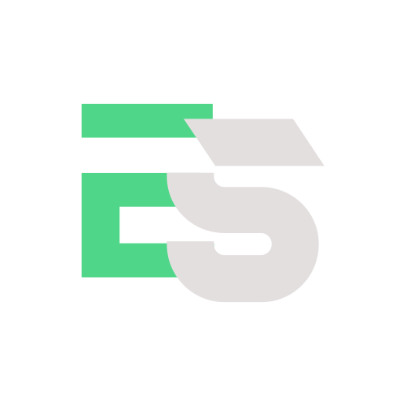

# My Portfolio

<div align="center">
  
  <h3 align="center">Personal Resume & Portfolio</h3>
  <p align="center">
    A modern, responsive personal portfolio website built with Next.js and Firebase
    <br />
    <a href="https://edensitko.com" target="_blank"><strong>View Live Demo »</strong></a>
  </p>
</div>

## ✨ Features

- 🌙 **Dark/Light Mode** - Toggle between dark and light themes
- 📱 **Responsive Design** - Optimized for all device sizes
- 🔥 **Firebase Integration** - Hosting and analytics
- ⚡ **Fast Performance** - Static site generation for optimal loading speed
- 📝 **Blog Section** - Share your thoughts and expertise
- 🖼️ **Project Showcase** - Display your work with detailed project pages
- 📊 **Analytics** - Track visitor engagement with Firebase Analytics

## 🚀 Tech Stack

- **Framework**: [Next.js 14](https://nextjs.org/)
- **Styling**: [Tailwind CSS](https://tailwindcss.com/)
- **Deployment**: [Firebase Hosting](https://firebase.google.com/docs/hosting)
- **Analytics**: [Firebase Analytics](https://firebase.google.com/docs/analytics)
- **Static Export**: Optimized for Firebase's free Spark plan

## 📋 Getting Started

### Prerequisites

- Node.js (v18 or higher)
- npm or yarn
- Firebase account

### Installation

1. Clone the repository
   ```sh
   git clone https://github.com/edensitko/myPortfolio.git
   cd myPortfolio
   ```

2. Install dependencies
   ```sh
   npm install
   # or
   yarn install
   ```

3. Set up environment variables
   Create a `.env.local` file in the root directory with your Firebase configuration:
   ```
   NEXT_PUBLIC_FIREBASE_API_KEY=your-api-key
   NEXT_PUBLIC_FIREBASE_AUTH_DOMAIN=your-auth-domain
   NEXT_PUBLIC_FIREBASE_PROJECT_ID=your-project-id
   NEXT_PUBLIC_FIREBASE_STORAGE_BUCKET=your-storage-bucket
   NEXT_PUBLIC_FIREBASE_MESSAGING_SENDER_ID=your-messaging-sender-id
   NEXT_PUBLIC_FIREBASE_APP_ID=your-app-id
   NEXT_PUBLIC_FIREBASE_MEASUREMENT_ID=your-measurement-id
   ```

4. Run the development server
   ```sh
   npm run dev
   # or
   yarn dev
   ```

5. Open [http://localhost:3000](http://localhost:3000) in your browser

### Deployment

1. Build the project
   ```sh
   npm run build
   # or
   yarn build
   ```

2. Deploy to Firebase
   ```sh
   npx firebase deploy
   ```

## 📁 Project Structure

```
/
├── public/              # Static assets
├── src/
│   ├── app/             # Next.js app router
│   ├── components/      # React components
│   ├── firebase/        # Firebase configuration
│   ├── hooks/           # Custom React hooks
│   ├── staticData/      # Static data for the site
│   └── context/         # React context providers
├── layout/              # Layout components
├── .env.local           # Environment variables (gitignored)
├── firebase.json        # Firebase configuration
├── next.config.mjs      # Next.js configuration
└── tailwind.config.js   # Tailwind CSS configuration
```

## 🔧 Customization

- Edit personal information in `src/staticData/home/home.js`
- Modify projects in `src/staticData/project/project.js`
- Update blog posts in `src/staticData/blog/blog.js`
- Customize site settings in `src/staticData/siteSettings.js`

## 📄 License

This project is based on a purchased template from ThemeForest with customizations.

## 📞 Contact

Eden Sitkovetsky - [GitHub](https://github.com/edensitko)

Project Link: [https://github.com/edensitko/myPortfolio](https://github.com/edensitko/myPortfolio)
